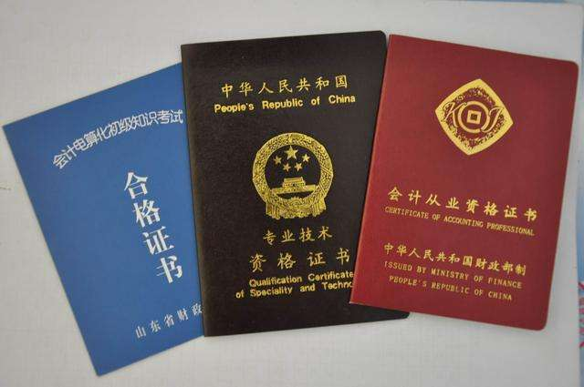

现如今，我国的经济发展是非常迅速的，这离不开我国国家的政策和形式多样的公司企业，而公司企业当中都需要有一个核心的人才，那便是会计人才，他既了解着公司的整体运营发展情况，而且还为老板出谋划策合理的避税理财，所以老板对于会计人员是非常重视的。

初中高中学历是可以学习会计的，但初中学历是不能考取会计证书，初级会计证书报名要求是具备高中（中专、职高、技校）及以上学历，**初中学历考生可以通过自考、成考等方式提升学历后报考初级会计证**。如果是初中学历大家要注意这一点。因为从业资格证书还是非常重要的，一旦考取从业资格证书全国通用，即使工作调转也无妨。

## 学习会计的优势：

1.学历要求低，不管你是中专、大专或是本科、研究生都可以从事会计工作，并且可以考取相关证书，只要公司在招录时候没有具体要求，就可以进入相关企业工作。

2.就业范围广，不管公司的规模大小，或是从事什么行业，只要公司需要运转，就离不开会计从业者，甚至还有一些小企业会出现“一会难求”的状态；如果你想要在以后换工作的话，会计证件也是一直通用的。

3.工作环境好相对轻松，会计的工作一般都在室内进行，同时不用遭受雨打风吹，更不经受日晒雨淋，而且因为业务上的保密性，有时候甚至还是独立的办公室。

4.工作相对稳定，会计一般掌握了公司的一些重要信息，尤其是财务相关的更是公司的商业机密，相信公司都会希望会计人员的变动更小，以防公司机密流出。

5.不吃青春饭，会计的发展空间大，刚刚入行的会计工作者往往不清楚具体的行业操作流程，只知道一些书本上的知识，而随着工作年限的增长，对于技术的掌握也越来越娴熟，越做越熟练，经验丰富，有着多年会计从业经验的人更受到欢迎。

 

**会计专业报考政策、报考要求、学校选择等，关注网站并私信专业老师，给您分享最新的报考政策与全国院校资料。**

**咨询孙老师：18563933700（微信同号）**

**咨询边老师：13522070128（微信同号）**

