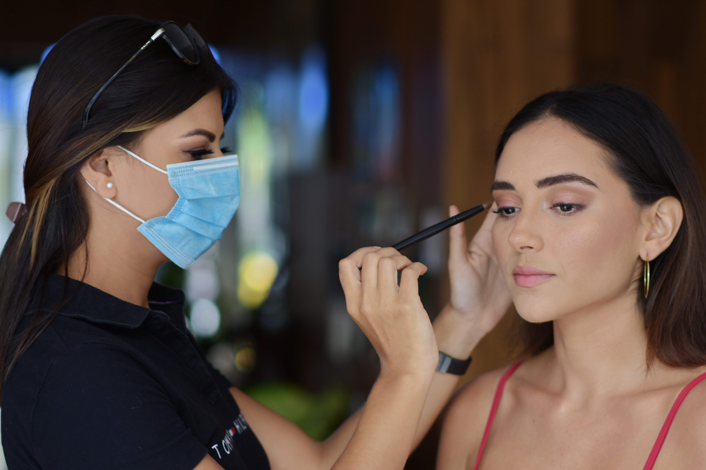

现在经常听到有很多初中毕业或者高中毕业升学失利，因为年纪较小家长们为孩子的未来生活感到担忧！升学的失利让他们一筹莫展，没了方向。

但是我想说的是，成功的道路并非升学一种，何不转变思路学习一门终生受用的技能呢？而现在国家也在提倡职业教育，技能型人才是非常稀缺的。**美妆专业便是非常适合孩子们读的专业**。不信？来看看美妆的相关介绍吧！

美容化妆主要包含常规化妆、新娘跟妆、影视化妆、特效化妆等；现今化妆技术的应用越来越广，化妆师的发展前景也越来越好，对于喜欢化妆，想从事化妆师行业的爱好者来说，化妆师将是一个不错的职业规划。

## 美妆专业的优势：

1、美妆可改变你在别人眼中的颜值分数，提升自我形象，获得更多的赞赏。而这种赞赏在一定程度上有利于自信心的增加，加大事情的成功性。

2、美妆不仅是一个技术，也是一个不会失业的工作，有着很广的发展前途。随着社会经济的发展和人们生活水平的提升，人们对化妆的需求也会日益增大。

3、美妆就业市场广泛（可以当化妆师，职业学校的化妆导师，、广告公司、影视剧组，化妆导购等），而且创业成本低，也很适合创业，例如婚礼跟妆，造型设计等。且女生是化妆的主要需求者，所以学彩妆的女生创业会更容易成功。

4美妆美化自己的同时，也能利用所学的一技之长让别人变美。这样更容易引起注意和欣赏你，有助于人际关系的建立和提升。

5、美妆行业时尚潮流，会提升你的审美能力，增加你的艺术细胞，练就对于时尚的敏感度。

以上便是美妆行业一些非常接地气的优势，各位想要学习此专业的同学需要找到一所正规的学校来进行学习，相信在学成之后，未来的生活会非常的顺遂，祝各位心想事成，前途光明！

**美妆专业报考政策、报考要求、学校选择等，关注网站并私信专业老师，给您分享最新的报考政策与全国院校资料。**

**咨询孙老师：18563933700（微信同号）**

**咨询边老师：13522070128（微信同号）**

